<div align="center">

# Swap Events Hub Client

**Enterprise Event Booking Platform — Discover, book, and manage events with confidence**

[](https://github.com/)
[](https://react.dev/)
[](https://nodejs.org/)
[](https://www.mongodb.com/)
[](https://tailwindcss.com/)

*Secure bookings · Real-time availability · Admin controls · OTP verification*

</div>

---

## Table of Contents

- [Overview](#overview)
- [Key Features](#key-features)
- [Application Flow](#application-flow)
- [Visual Walkthrough](#visual-walkthrough)
  - [Home & Event Discovery](#1-home--event-discovery)
  - [Authentication](#2-authentication)
  - [Event Booking & OTP](#3-event-booking--otp)
  - [User Dashboard](#4-user-dashboard)
  - [Admin Dashboard](#5-admin-dashboard)
  - [Email Notifications](#6-email-notifications)
- [Tech Stack](#tech-stack)
- [Project Structure](#project-structure)
- [Getting Started](#getting-started)
- [Available Scripts](#available-scripts)
- [API Reference](#api-reference)
- [Security & Best Practices](#security--best-practices)
- [Author](#author)
- [License](#license)

---

## Overview

**Swap Events Hub Client** is a full-stack MERN application that enables users to discover events, reserve seats with OTP-verified bookings, and track reservations from a personal dashboard. Administrators manage events, review booking requests, and confirm payments from a dedicated control panel.

Built with a responsive, enterprise-grade UI using **React**, **Tailwind CSS v4**, and **Vite**, backed by a secure **Express** REST API and **MongoDB** persistence layer.

---

## Key Features

<table>
<tr>
<td width="50%">

### User Features
- Event discovery with search
- Category-based browsing
- Secure registration & login
- OTP account verification
- OTP-verified event booking
- Duplicate booking prevention
- Personal booking dashboard
- Booking status tracking (pending, confirmed, cancelled)
- Payment status visibility (paid / not paid)
- Cancel booking with confirmation modal
- OTP resend with cooldown timer

</td>
<td width="50%">

### Admin Features
- Platform control center
- Create & delete events
- Real-time seat availability
- Revenue & client metrics
- Pending request monitoring
- Approve bookings as paid / unpaid
- Reject booking requests
- Role-based route protection

</td>
</tr>
<tr>
<td colspan="2">

### Platform Capabilities
- JWT authentication with bcrypt password hashing
- Branded HTML email templates (OTP & confirmation)
- Shared UI component library (Alert, Button, Input, Modal, StatusBadge)
- Responsive layout across mobile, tablet, and desktop
- Concurrent dev script to run client + server together
- Database seeding for demo data
- Comprehensive `.gitignore` — no secrets committed

</td>
</tr>
</table>

---

## Application Flow

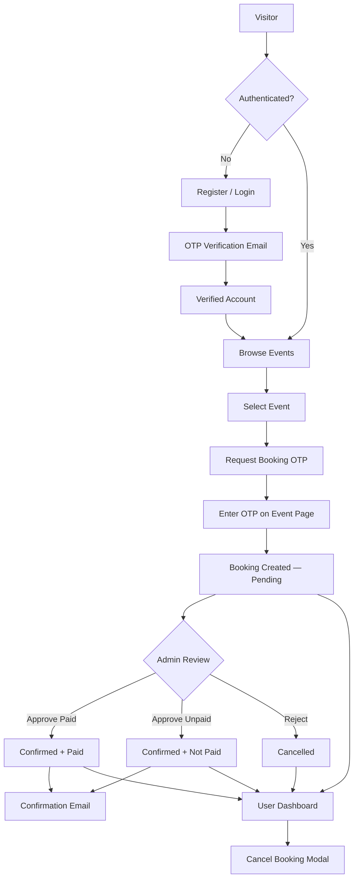

| Step | Actor | Action |
|------|-------|--------|
| 1 | User | Registers account and verifies via email OTP |
| 2 | User | Logs in and browses / searches upcoming events |
| 3 | User | Opens event details and requests a booking OTP |
| 4 | User | Enters OTP to submit booking request |
| 5 | System | Sends branded OTP and confirmation emails |
| 6 | Admin | Reviews pending requests — approve or reject |
| 7 | User | Tracks bookings and cancels via dashboard modal |

---

## Visual Walkthrough

> Screenshots below demonstrate the end-to-end platform experience. No credentials or private configuration values are included.

---

### 1. Home & Event Discovery

The landing page highlights platform value propositions, provides event search, and lists upcoming events with category filters.

<p align="center">
  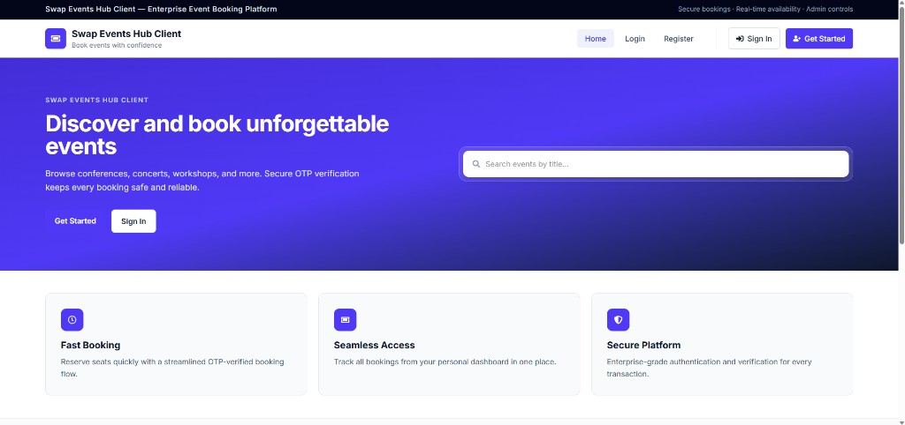
</p>

<p align="center"><em>Hero section — search events, feature cards, and call-to-action buttons</em></p>

<p align="center">
  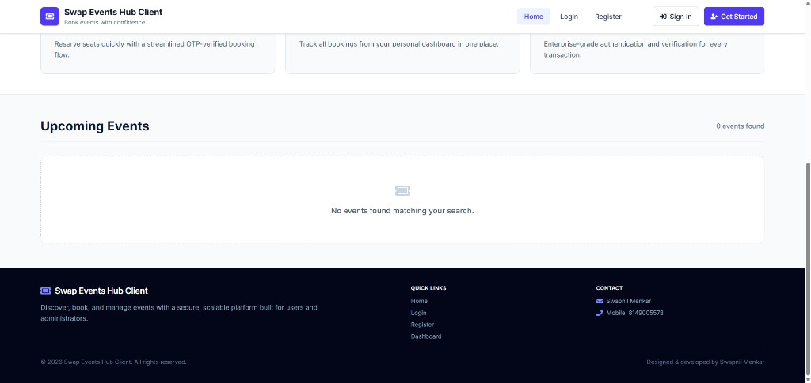
</p>

<p align="center"><em>Upcoming events grid with responsive cards and professional footer navigation</em></p>

| Capability | Details |
|------------|---------|
| Search | Filter events by title in real time |
| Feature cards | Fast booking, seamless access, secure platform |
| Event cards | Image, category, date, price, and availability |
| Navigation | Home, Login, Register, Dashboard links |

---

### 2. Authentication

Professional auth cards with gradient headers for registration and login flows.

<p align="center">
  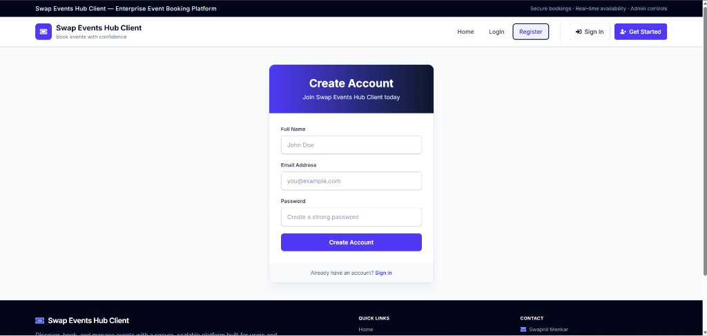
</p>

<p align="center"><em>Create Account — name, email, password with OTP verification on submit</em></p>

<p align="center">
  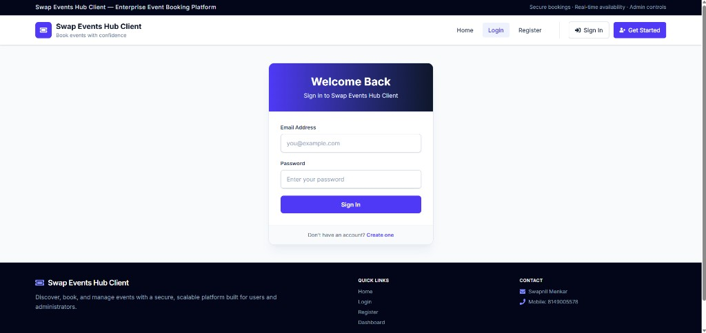
</p>

<p align="center"><em>Sign In — JWT-based authentication with redirect to dashboard</em></p>

| Capability | Details |
|------------|---------|
| Registration | Name, email, password with validation |
| OTP verification | Email OTP for new account activation |
| OTP resend | Cooldown-protected resend button |
| Login | Secure session via JWT token |
| Role routing | Users → Dashboard, Admins → Admin panel |

---

### 3. Event Booking & OTP

Event detail pages show full metadata, seat availability, and a secure OTP booking flow.

<p align="center">
  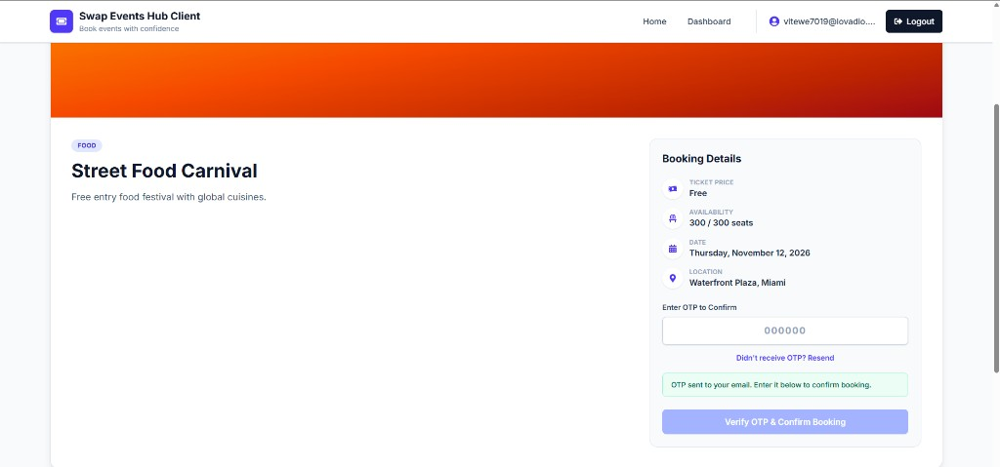
</p>

<p align="center"><em>Booking flow — request OTP, enter code, and confirm reservation</em></p>

<p align="center">
  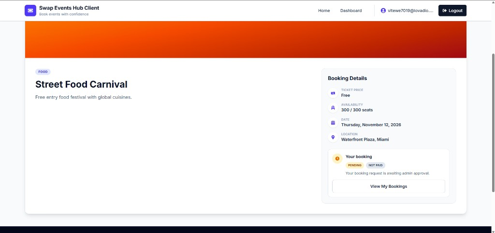
</p>

<p align="center"><em>After booking — pending status with link to user dashboard</em></p>

| Capability | Details |
|------------|---------|
| Event details | Price, seats, date, location, category |
| OTP booking | Two-step: send OTP → verify & confirm |
| Duplicate check | Prevents multiple active bookings per event |
| Status display | Pending / confirmed / cancelled badges |
| Resend OTP | Available with 30-second cooldown |

---

### 4. User Dashboard

Personal hub to view and manage all event bookings in one place.

<p align="center">
  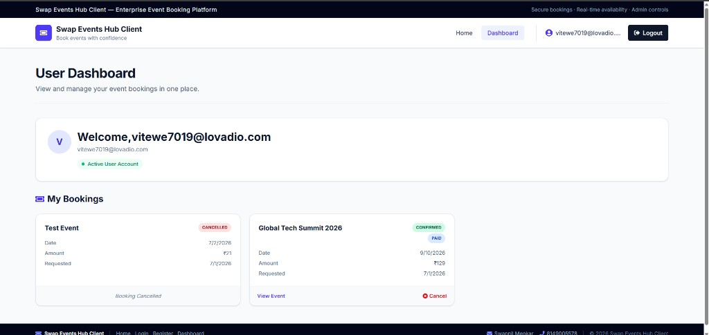
</p>

<p align="center"><em>Profile summary and booking cards with status badges</em></p>

<p align="center">
  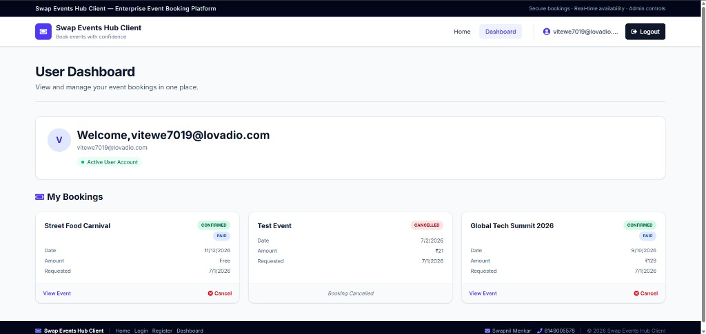
</p>

<p align="center"><em>Multiple bookings — confirmed, paid, pending, and cancelled states</em></p>

| Capability | Details |
|------------|---------|
| Profile card | Welcome message and account status |
| Booking cards | Event name, date, amount, request date |
| Status badges | Confirmed, paid, pending, cancelled |
| Actions | View event, cancel with confirmation modal |
| Real-time refresh | Updates after admin actions |

---

### 5. Admin Dashboard

Platform control center for event management and booking approval workflows.

<p align="center">
  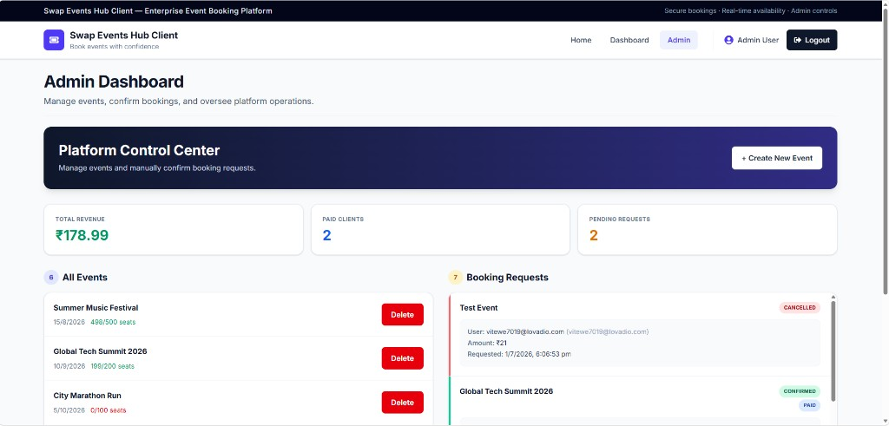
</p>

<p align="center"><em>Metrics — revenue, paid clients, pending requests, event list</em></p>

<p align="center">
  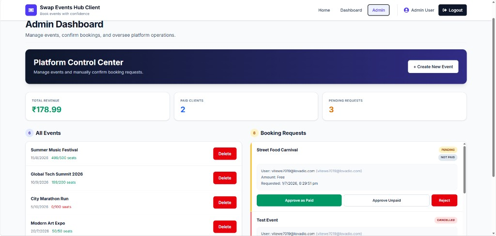
</p>

<p align="center"><em>Approve as paid, approve unpaid, or reject with confirmation modal</em></p>

| Capability | Details |
|------------|---------|
| KPI cards | Total revenue, paid clients, pending count |
| Event management | Create new events, delete existing ones |
| Seat tracking | Available / total seats per event |
| Booking review | Approve paid, approve unpaid, reject |
| Confirm modals | Professional dialogs for delete & reject |

---

### 6. Email Notifications

Branded HTML email templates for booking OTP verification and confirmation.

<p align="center">
  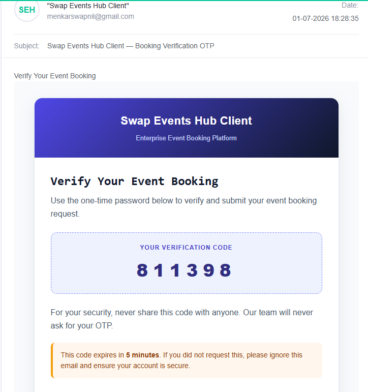
</p>

<p align="center"><em>Booking OTP email — 6-digit code with 5-minute expiry notice</em></p>

<p align="center">
  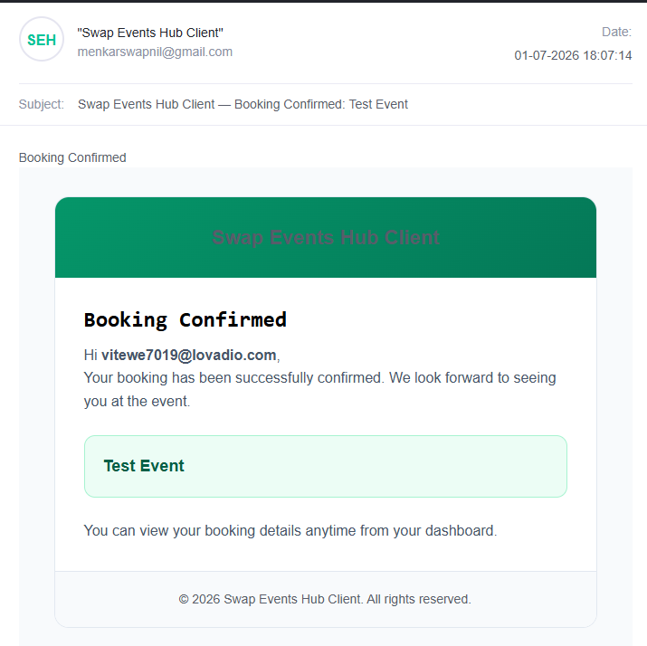
</p>

<p align="center"><em>Booking confirmed email — event details and dashboard link</em></p>

| Email Type | Purpose |
|------------|---------|
| Account OTP | Verify new user registration |
| Booking OTP | Confirm event reservation request |
| Booking confirmed | Notify user after admin approval |

---

## Tech Stack

| Layer | Technologies |
|-------|--------------|
| **Frontend** | React 18, Vite 6, Tailwind CSS v4, React Router 7, Axios, React Icons |
| **Backend** | Node.js, Express 5, Mongoose, JWT, bcryptjs, Nodemailer |
| **Database** | MongoDB (local or Atlas) |
| **Dev Tools** | Nodemon, ESLint, Concurrently |
| **Auth** | JWT tokens, OTP email verification, role-based access (user / admin) |

---

## Project Structure

```
mern-event-booking/
├── client/                 # React frontend (Vite + Tailwind)
│   └── src/
│       ├── components/     # Layout, Navbar, Footer, UI library
│       ├── context/        # AuthContext (JWT session)
│       ├── pages/          # Home, Login, Register, Dashboards, EventDetail
│       └── utils/          # Axios API client
├── server/                 # Express REST API
│   ├── controllers/        # Auth, events, bookings logic
│   ├── middlewares/        # JWT protect & admin guard
│   ├── models/             # User, Event, Booking, Otp schemas
│   ├── routes/             # /auth, /events, /bookings
│   ├── utils/              # Email templates, OTP helpers
│   └── seed.js             # Sample data loader
├── docs/
│   └── screenshots/        # Application screenshots for documentation
├── package.json            # Root scripts (concurrently)
└── README.md
```

---

## Getting Started

### Prerequisites

- **Node.js** v20+ recommended
- **MongoDB** (local instance or Atlas cluster)
- **npm**
- **SMTP email account** (for OTP delivery)

### 1. Clone the repository

```bash
git clone <repository-url>
cd mern-event-booking
```

### 2. Install dependencies

From the project root:

```bash
npm run install:all
```

Or install each package separately:

```bash
cd server && npm install
cd ../client && npm install
```

### 3. Environment configuration

Create `server/.env` locally (**never commit this file**):

```env
PORT=5000
MONGODB_URI=mongodb://localhost:27017/swap-events-hub
JWT_SECRET=your_jwt_secret_here
EMAIL_USER=your_email@example.com
EMAIL_PASS=your_email_app_password
```

| Variable | Description |
|----------|-------------|
| `PORT` | API port (default `5000`) |
| `MONGODB_URI` | MongoDB connection string |
| `JWT_SECRET` | Long random string for signing JWT tokens |
| `EMAIL_USER` | SMTP email address (local development) |
| `EMAIL_PASS` | Gmail App Password (local development only) |
| `EMAIL_PROVIDER` | `smtp` (local) or `resend` (Render production) |
| `RESEND_API_KEY` | Resend API key — **required on Render** |
| `EMAIL_FROM` | Sender address (e.g. `onboarding@resend.dev` for Resend testing) |

> **Local development:** Use `EMAIL_PROVIDER=smtp` with Gmail App Password.
>
> **Render production:** Render **blocks outbound SMTP** (ports 465/587). Gmail SMTP will fail with `ETIMEDOUT` / `ENETUNREACH`. Use the **Resend HTTP API** instead:
> 1. Create a free account at [resend.com](https://resend.com)
> 2. Generate an API key
> 3. On Render set: `EMAIL_PROVIDER=resend`, `RESEND_API_KEY=re_...`, `EMAIL_FROM=onboarding@resend.dev`
> 4. Redeploy

Optional client override — create `client/.env.local` if the API URL differs:

```env
VITE_API_URL=http://localhost:5000/api/v1
```

> **Important:** Do not commit `.env`, `.env.local`, or any environment template files to version control.

### 4. Seed sample data (optional)

```bash
npm run seed
```

### 5. Run the application

From the **project root**:

```bash
npm run dev
```

| Service | URL |
|---------|-----|
| **API** | http://localhost:5000 |
| **Client** | http://localhost:5173 |

Run individually if needed:

```bash
npm run dev:server    # API only
npm run dev:client    # Frontend only
```

---

## Available Scripts

### Root (`/`)

| Command | Description |
|---------|-------------|
| `npm run install:all` | Install root, server, and client dependencies |
| `npm run dev` | Start server and client in development mode |
| `npm run dev:server` | Start API only (nodemon) |
| `npm run dev:client` | Start frontend only (Vite) |
| `npm run start` | Start API + client preview (production build) |
| `npm run build` | Build client for production |
| `npm run seed` | Seed database with sample data |

### Server (`/server`)

| Command | Description |
|---------|-------------|
| `npm run dev` | Start API with nodemon |
| `npm start` | Start API in production mode |
| `npm run seed` | Seed database with sample data |

### Client (`/client`)

| Command | Description |
|---------|-------------|
| `npm run dev` | Start development server |
| `npm run build` | Build for production |
| `npm run preview` | Preview production build |

---

## API Reference

**Base URL:** `http://localhost:5000/api/v1`

### Authentication — `/auth`

| Method | Endpoint | Access | Description |
|--------|----------|--------|-------------|
| `POST` | `/auth/register` | Public | Register new user |
| `POST` | `/auth/login` | Public | Login and receive JWT |
| `POST` | `/auth/verify-otp` | Public | Verify account OTP |

### Events — `/events`

| Method | Endpoint | Access | Description |
|--------|----------|--------|-------------|
| `GET` | `/events` | Public | List all events |
| `GET` | `/events/:id` | Public | Get event by ID |
| `POST` | `/events` | Admin | Create new event |
| `PUT` | `/events/:id` | Admin | Update event |
| `DELETE` | `/events/:id` | Admin | Delete event |

### Bookings — `/bookings`

| Method | Endpoint | Access | Description |
|--------|----------|--------|-------------|
| `POST` | `/bookings/send-otp` | User | Send booking OTP to email |
| `POST` | `/bookings` | User | Create booking with OTP |
| `GET` | `/bookings/my` | User | Get current user's bookings |
| `GET` | `/bookings/event/:eventId/status` | User | Check active booking for event |
| `PUT` | `/bookings/:id/confirm` | Admin | Approve booking (paid / not paid) |
| `DELETE` | `/bookings/:id` | User / Admin | Cancel or reject booking |

---

## Security & Best Practices

| Area | Implementation |
|------|----------------|
| **Passwords** | Hashed with bcrypt before storage |
| **Sessions** | JWT tokens with configurable expiry |
| **OTP** | Time-limited codes for account and booking verification |
| **Authorization** | Middleware guards for protected and admin-only routes |
| **Environment** | All secrets stored in local `.env` files only |
| **Git safety** | Comprehensive `.gitignore` for env files, keys, and credentials |
| **UI confirmations** | Custom modals replace browser alerts for destructive actions |
| **Duplicate prevention** | Server-side check for existing active bookings |

---

## Author

<table>
<tr>
<td>

**Swapnil Menkar**

Mob: 8149005578

LinkedIn: [swapnil-menkar-7051852b](https://www.linkedin.com/in/swapnil-menkar-7051852b/)

</td>
</tr>
</table>

---

## License

ISC

---

<div align="center">

**Swap Events Hub Client** — Built with MERN Stack · React · Tailwind CSS · MongoDB

*Designed & developed by Swapnil Menkar*

</div>
